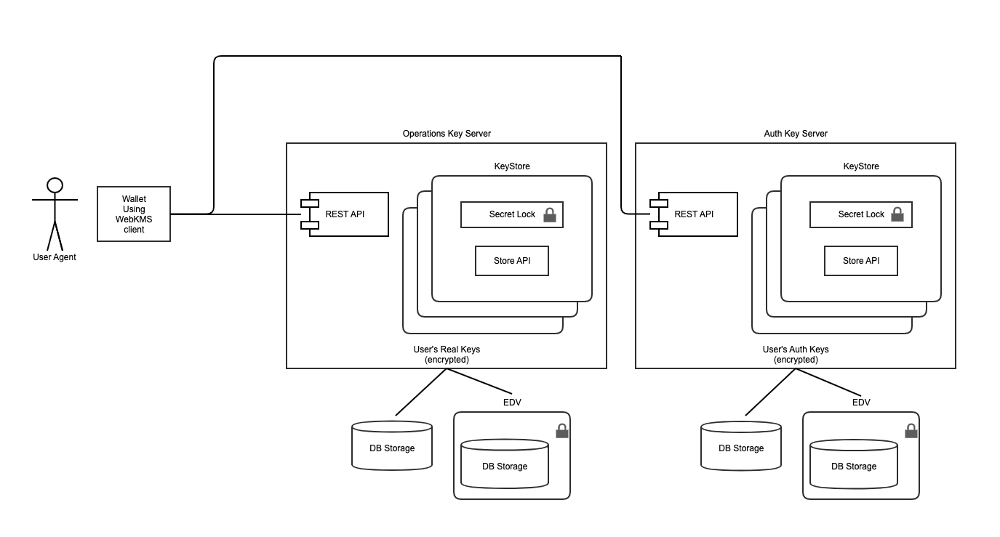

#Trustbloc KMS Server Design

The following portrays an overview of the KMS server usage in a Trustbloc environment:

A user's wallet has a webkms API client to communicate with the KMS servers. There are 2 main KMS servers used in the environment which are described below.

## Authorization key Server
The right server in the above diagram is dedicated to creating authorization keys on behalf of an agent. Such keys are used to secure the user's operational keystore or are keys used for EDV storage authorization. These authorization specific keys are stored in a keystore protected by a secret lock using Shamir secret splitting: only half of the primary key that locks the keystore is stored on the server. The other half is stored elsewhere to increase the protection of the keystore if the server is compromised.

## Operations Key Server
The left server in the above diagram stores operational keys used by a wallet to execute crypto primitives oh behalf of the user and are stored in a user specific keystore that is protected by a secret lock with a primary key sourced from the Authorization key server.

## SecretLock protecting the user's keystore
Keys stored in a keystore must be protected by encryption to prevent leakage of keys materials. Enter SecretLock; its sole purpose is to encrypt keys prior to storage. There are different flavors of SecretLocks based on the needed use case. Those used in an Operations Key Server can be either passphrase based, hash based or AWS source locks. They depend on an outside source for the primary key to be extracted (or derived) and used in encrypting operation Keys. An Authorization Key Server will require an additional operation in front of these locks to reconstruct a passphrase or a secret fed to the SecretLock using Shamir secret splitting algorithm to rebuild the passphrase (or secret).

## WebKMS client API communication with a Key Server REST API
A user's wallet communicates with a key server via a webkms API client that triggers REST requests on the Key Server's REST interface. These operations involve either key based operations (Create, Rotate, Delete, ExportPublicKey, etc.) or crypto primitive executions (Sign, Verify, Encrypt, KeyWrap, etc.). The API is self-explanatory.