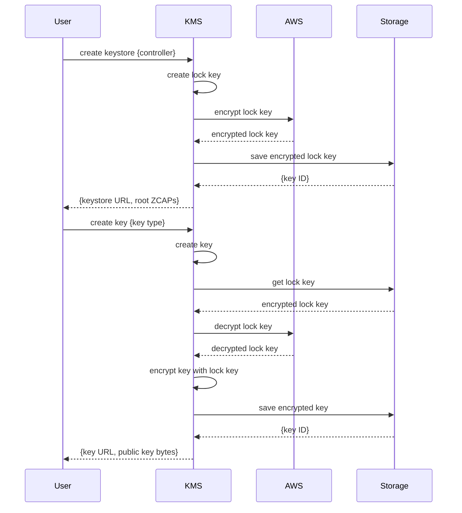
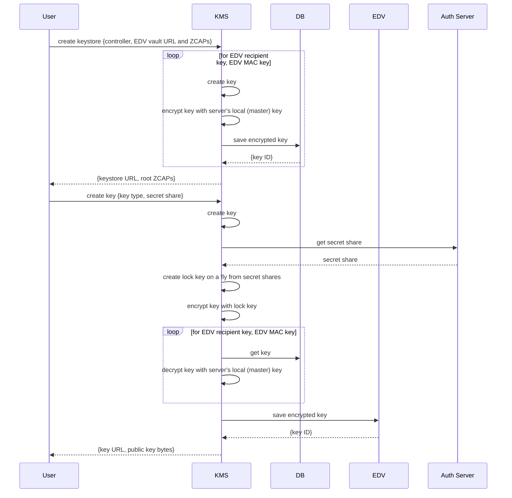

# Use Cases

**Scenario 1**: server's lock is based on AWS key, user's lock uses local key, no EDV

In this scenario, a key for the user's lock is created when the key store is created. That key is encrypted with an AWS
key and stored in the server's DB. When a working key is created for the user, it is encrypted with that stored lock key.
Before using, user's lock key should be decrypted with an AWS key.

**Scenario 2**: server's lock is based on local key, user's lock uses Shamir-based key, working keys are stored in EDV

Key for the server's lock is stored in a local file and the path to it is specified in a startup flag or environment
variable. When a key store is created, helper recipient and MAC keys for the EDV provider are created as well. They are
encrypted with a key from the local file (server's lock) and saved to the server's DB. These keys are associated with
a created key store to support EDV operations.

User's lock key is created on a fly using HKDF algorithm that expands the combined secret (from shares using Shamir
Secret Sharing) into a symmetric key. That key is used to encrypt/decrypt the user's working keys stored in EDV.

