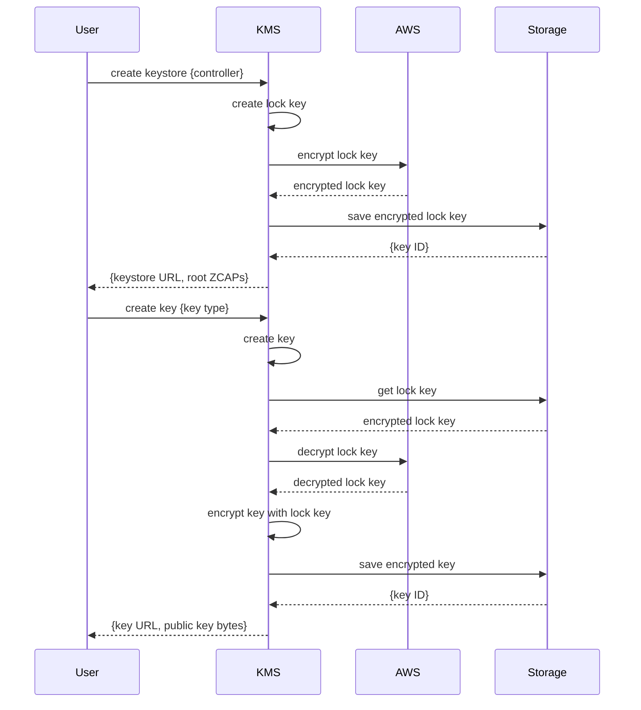

# Use Cases

**Scenario 1**: server's lock is based on AWS key, user's lock uses local key

In this scenario, a key for the user's lock is created when the key store is created. That key is encrypted with an AWS
key and stored in the server's DB. When a working key is created for the user, it is encrypted with that stored lock key.
Before using, user's lock key should be decrypted with an AWS key.

